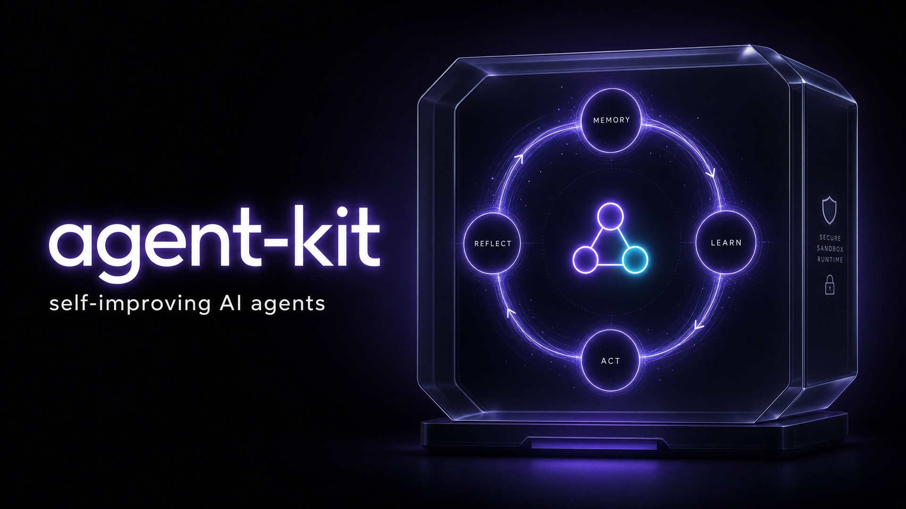
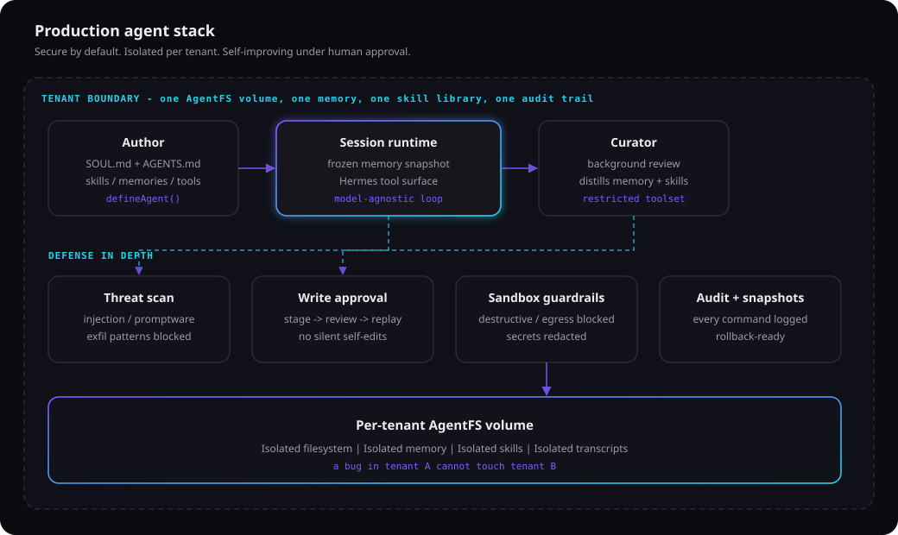

<div align="center">



<br/>

### Production-grade agents.<br/>Secure. Sandboxed. Self-improving.

A TypeScript toolkit for shipping AI agents that are multi-tenant-safe, without complex infrastructure.
Curated memory, human-gated learning, and a real execution sandbox.

[](https://www.npmjs.com/package/@socialrobot-io/agent-kit-core)
[](LICENSE)
[](https://www.typescriptlang.org/)
[](https://nx.dev)
[](https://bun.sh)

[Why](#why) · [How it works](#how-it-works) · [Try it](#try-it) · [Install](#install) · [Set up](#set-up) · [Wire into your app](#wire-into-your-app) · [Security](#security) · [Docs](#docs)

</div>

---

## Why

Most agent frameworks optimize for demos. agent-kit optimizes for shipping
agents into production, where one mistake can delete files, leak secrets, or
cross tenant boundaries.

| Pillar | What you get |
| ------ | ------------ |
| **Secure by default** | Prompt-injection, promptware, and exfiltration scanning on every memory and skill write. Threats never reach the system prompt. |
| **Sandboxed execution** | Per-tenant [AgentFS](https://www.agentfs.ai/) volumes and [bash-tool](https://github.com/vercel-labs/bash-tool) guardrails. Destructive commands, secret exfil, and non-allowlisted network egress are blocked before they run. |
| **Production multi-tenancy** | One isolated filesystem, memory, skill library, transcript store, and audit trail per tenant. A bug in tenant A cannot touch tenant B. |
| **Self-improving under approval** | A background curator distills sessions into durable memory and reusable skills. Writes stage for human review. They are never applied silently. |

Learning without a sandbox is a liability. A sandbox without learning is just a
cage. agent-kit is both.

It is a **library**, not a hosted service. You authenticate users, map each one
to a `tenantId`, and open a per-tenant home. The kit supplies the volume,
sandbox, session runtime, and learning loop.

**Hosting shape today:** one Node process and one local SQLite volume file per
tenant. Multi-machine hosting is not ready yet
([roadmap](docs/roadmap/multi-machine.md)).

### Built on

agent-kit composes existing libraries. The [Vercel AI SDK](https://sdk.vercel.ai/)
shapes most of the live API (`ModelMessage`, `session.run` / `session.stream`,
`toolApproval`, and AI SDK UI `useChat`).

| Layer | Library | What you feel in the API |
| ----- | ------- | ------------------------ |
| Model loop | [`ai`](https://www.npmjs.com/package/ai) (Vercel AI SDK) | Messages, `run` / `stream`, tools, UI approval |
| Model routing | [`@ai-sdk/gateway`](https://www.npmjs.com/package/@ai-sdk/gateway) | String model ids (e.g. `anthropic/claude-sonnet-4-5`) |
| Tenant volume | [AgentFS](https://www.agentfs.ai/) | One SQLite filesystem per tenant |
| Sandbox shell | [bash-tool](https://github.com/vercel-labs/bash-tool) + [just-bash](https://github.com/vercel-labs/just-bash) | `bash` / `readFile` / `writeFile` behind guardrails |

If you already use the AI SDK, agent-kit slots in as the tenant home, memory,
skills, and sandbox around that loop.

---

## How it works

Read this once before you install. Setup makes more sense with the loop in mind.

<div align="center">

</div>

<br/>

1. **Author** the agent as markdown files: who it is (`SOUL.md`), house rules
   (`AGENTS.md`), optional skills and memories.
2. **Open a session** for one tenant. Pass the compiled or loaded agent bundle
   so identity lands on the volume. The system prompt is built once from those
   files plus a memory snapshot that does not change mid-chat.
3. **Guard** writes and shell commands. Bad content is scanned before it can
   enter a future prompt. Dangerous commands are blocked before they run.
4. **Curate** after each turn. `createTenantHome` runs a background pass that
   may propose lasting memory or skills (disable with `config.curator: false`).
5. **Approve.** Proposals sit under `pending/` until a human accepts them.
6. **Recall.** The next chat sees approved memory. Past chats for that tenant
   are searchable; other tenants are not.

Your app owns auth and `tenantId`. The kit owns isolation, scanning, sandbox,
and the approval gate.

---

## Try it

Clone an example, or jump to [Install](#install) to wire the package into your
own app.

| Example | What it shows |
| ------- | ------------- |
| [`examples/example-app`](examples/example-app) | Streaming Next.js chat + `/code-runner` page with `js-exec` |

```bash
git clone https://github.com/socialrobot-io/agent-kit.git
cd agent-kit && bun install
cd examples/example-app
cp .env.sample .env.local   # set DEEPSEEK_API_KEY or AI_GATEWAY_API_KEY
npx nx dev example          # http://localhost:3000
# Code runner (js-exec): http://localhost:3000/code-runner
```

---

## Install

**Requirements**

- Node.js 20+ (or Bun)
- Durable local disk for per-tenant SQLite volumes (one machine today)
- A model provider for live turns

String model ids (for example `anthropic/claude-sonnet-4-5`) use the
[Vercel AI Gateway](https://vercel.com/ai-gateway). Set a key before the first
turn:

```bash
export AI_GATEWAY_API_KEY=...   # or pass a ready LanguageModel via `model`
```

Happy path package (volume + transcripts + sandbox + live loop):

```bash
npm i @socialrobot-io/agent-kit-node
# also pulls core, ai, sessions, sandbox
```

| Package | Job |
| ------- | --- |
| [`…-node`](https://www.npmjs.com/package/@socialrobot-io/agent-kit-node) | `createTenantHome` (volume, sandbox, sessions, curator) |
| [`…-core`](https://www.npmjs.com/package/@socialrobot-io/agent-kit-core) | Definition, memory, skills, approval |
| [`…-ai`](https://www.npmjs.com/package/@socialrobot-io/agent-kit-ai) | `AgentSession.run` / `.stream` |
| [`…-sessions`](https://www.npmjs.com/package/@socialrobot-io/agent-kit-sessions) | Transcripts + `session_search` |
| [`…-sandbox`](https://www.npmjs.com/package/@socialrobot-io/agent-kit-sandbox) | Volume + guarded bash |
| [`…-curator`](https://www.npmjs.com/package/@socialrobot-io/agent-kit-curator) | Background review (wired by `…-node`) |

---

## Set up

Three steps: author files, compile them into your app, run a turn.

### 1. Author the agent as files

The agent is a directory of markdown, not a large config object.

```text
agent/
  SOUL.md       who the agent is (always in the system prompt)
  AGENTS.md     house rules
  skills/       reusable how-to procedures (optional)
  memories/     USER.md and MEMORY.md (optional; behind approval when learned)
```

Example `SOUL.md`:

```md
You are a concise research assistant for a fintech startup.
```

Example `AGENTS.md`:

```md
Prefer short, factual answers.
Cite a source for every non-obvious claim.
Never invent numbers.
```

Skills under `agent/skills/` are mutable unless you mark them locked
(`locked: true` / `pinned` / `bundled` in frontmatter, or a `.locked` marker).
See [Skills & learning](docs/guides/skills-and-learning.md).

### 2. Compile the agent, open a tenant home, run a turn

`createTenantHome` only installs identity and skills when you pass `agent`.
Compile `agent/` in CI / predev into an importable module so Next, Docker, and
workers ship the content without a runtime `agent/` directory on disk.

```js
// scripts/compile-agent.mjs — wire into predev / prebuild
import { compileAgent } from "@socialrobot-io/agent-kit-node";

await compileAgent({
  dir: "./agent",
  outFile: "./src/generated/agent.ts",
});
```

```ts
import { createTenantHome } from "@socialrobot-io/agent-kit-node";
import { agent } from "./generated/agent"; // output of compileAgent

const tenantId = "brand-123"; // from your auth layer — never from the client body alone
const sessionId = "chat-abc";

// Default: ./data/tenants/${tenantId}.db + transcripts + sandbox
// + model anthropic/claude-sonnet-4-5 via AI Gateway.
const home = await createTenantHome({ tenantId, agent });

// Memory freezes when openSession returns. Reuse that AgentSession for the
// life of the chat (cache by sessionId in your process). Calling openSession
// again rebuilds the snapshot from disk.
const session = await home.openSession(sessionId);

const turn = await session.run([
  { role: "user", content: "Summarize /workspace; prefer short answers going forward." },
]);
```

Plain Node scripts that can read `./agent` at runtime may use
`loadAgent("./agent")` instead of compile + import.

### 3. Override only what you need

```ts
const home = await createTenantHome({
  tenantId,
  agent,
  dataDir: "/var/lib/agents",           // or volumePath: "/data/acme.db"
  model: "anthropic/claude-sonnet-4-5", // or a ready LanguageModel
  interactiveApproval: true,            // UI Approve applies writes
  workspaceFiles: { "README.md": "# hi\n" },
  sandbox: {
    // Hostnames only (not full URLs). Or sandbox: false to disable.
    allowedHosts: ["api.example.com"],
    secrets: [process.env.TENANT_API_KEY!],
  },
});

const session = await home.openSession(sessionId, {
  addTools: [myTool],
  disableTools: ["skill_manage"],
});
```

You now have a working turn. Next: put auth, session cache, and transcripts
around it.

---

## Wire into your app

Your app authenticates the user. The kit only trusts the `tenantId` you pass.

```ts
import type { AgentSession } from "@socialrobot-io/agent-kit-ai";
import { createTenantHome } from "@socialrobot-io/agent-kit-node";
import { agent } from "./generated/agent"; // from compileAgent in predev / CI

// Reuse the same AgentSession for a chat so memory stays frozen.
// Key includes tenantId so two tenants never share a session handle.
const sessions = new Map<string, AgentSession>();

async function handleTurn(opts: {
  tenantId: string; // from your auth layer — never from the request body alone
  sessionId: string; // one id per chat conversation
  userText: string;
  userMessageId: string;
}) {
  // Opens (or reuses) volume + transcripts + sandbox for this tenant.
  const home = await createTenantHome({ tenantId: opts.tenantId, agent });

  const key = `${opts.tenantId}:${opts.sessionId}`;
  let session = sessions.get(key);
  if (!session) {
    session = await home.openSession(opts.sessionId);
    sessions.set(key, session);
  }

  // Persist both sides so session_search can browse past chats.
  await home.transcripts!.createSession({
    id: opts.sessionId,
    tenantId: opts.tenantId,
    source: "api",
    createdAt: Date.now() / 1000,
  });
  await home.transcripts!.appendMessage({
    id: opts.userMessageId,
    sessionId: opts.sessionId,
    role: "user",
    content: opts.userText,
    createdAt: Date.now() / 1000,
  });

  const turn = await session.run([{ role: "user", content: opts.userText }]);

  await home.transcripts!.appendMessage({
    id: `asst_${Date.now()}`,
    sessionId: opts.sessionId,
    role: "assistant",
    content: turn.text || "(no text)",
    createdAt: Date.now() / 1000,
  });

  return turn;
}
```

For streaming Next.js chat, copy [`examples/example-app`](examples/example-app).
More detail: [Hosting](docs/guides/hosting.md).

---

## Security

| Layer | Stops |
| ----- | ----- |
| **Threat scanning** | Injection and exfil patterns in memory/skills before they reach the prompt. Bad on-disk entries show as `[BLOCKED]`. |
| **Write approval** | Silent self-edits. Background and skill writes wait for a human. |
| **Sandbox** | Destructive shell, secret dumps, hosts you did not allow. |
| **Tenant isolation** | One volume and audit trail per tenant. Search never crosses tenants. |

Before you ship:

1. Resolve `tenantId` only from trusted auth. Use an opaque id safe for paths.
2. Pass `agent` so company identity and skills are installed on the volume.
3. Lock company-owned skills; unlocked skills stay mutable behind approval.
4. Pass sandbox `secrets` and hostname-only `allowedHosts` at home creation.
5. Do not hand tools the raw volume write handle.

Details: [Security guide](docs/guides/security.md).

---

## Docs

Read in this order when you integrate:

| Guide | Answers |
| ----- | ------- |
| [Getting started](docs/guides/getting-started.md) | Install, `agent/` files, first turn |
| [Hosting](docs/guides/hosting.md) | Auth, volume, session, approve in your app |
| [Security](docs/guides/security.md) | Scans, approval, isolation |
| [Tools](docs/guides/tools.md) | Host tools vs sandbox vs skills |
| [Sandbox](docs/guides/sandbox.md) | Curl, `js-exec`, `python3`, custom bash cmds |
| [Models](docs/guides/models.md) | Pick a model, run or stream a turn |
| [Memory](docs/guides/memory.md) | What is remembered across chats |
| [Skills & learning](docs/guides/skills-and-learning.md) | Skills, curator, human approve |
| [Publishing](docs/guides/publishing.md) | npm release (maintainers) |

Not ready yet: [Multi-machine](docs/roadmap/multi-machine.md).

---

## Commands (contributors)

```bash
bun install
npx nx run-many -t test --all
npx nx run-many -t build --all
```

Before a commit: `npx nx run-many -t typecheck test build --all` must be green.

## License

MIT. See [`NOTICE`](NOTICE) for third-party attribution.

<div align="center">

<br/>
<b>agent-kit</b>: agents you can ship.
</div>
