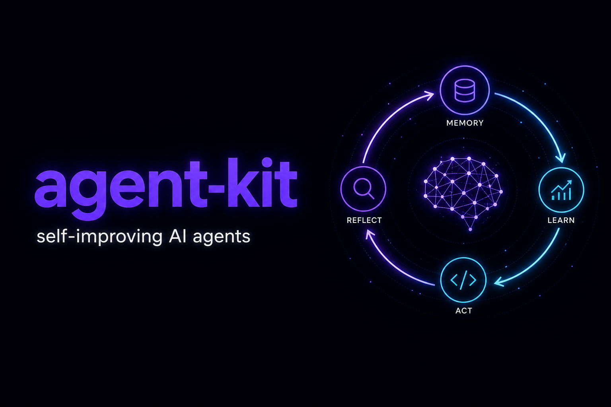

<div align="center">



<br/>

### Production-grade agents.<br/>Secure. Sandboxed. Self-improving.

A TypeScript toolkit for shipping AI agents that are safe enough for multi-tenant SaaS.
Curated memory, human-gated learning, and a real execution sandbox.

[](https://www.npmjs.com/package/@socialrobot-io/agent-kit-core)
[](LICENSE)
[](https://www.typescriptlang.org/)
[](https://nx.dev)
[](https://bun.sh)

[Why](#why) · [Install](#install) · [Quick start](#quick-start) · [How it works](#how-it-works) · [Security](#security) · [Docs](docs/)

</div>

---

## Why

Most agent frameworks optimize for demos. agent-kit optimizes for shipping
agents into production, where one mistake can delete files, leak secrets, or
cross tenant boundaries.

| Pillar | What you get |
| ------ | ------------ |
| **Secure by default** | Prompt-injection, promptware, and exfiltration scanning on every memory and skill write. Threats never reach the system prompt. |
| **Sandboxed execution** | Per-tenant [AgentFS](https://www.agentfs.ai/) volumes and [bash-tool](https://github.com/vercel-labs/bash-tool) guardrails. Destructive commands, secret exfil, and non-allowlisted network egress are blocked before they run. |
| **Production multi-tenancy** | One isolated filesystem, memory, skill library, transcript store, and audit trail per tenant. A bug in tenant A cannot touch tenant B. |
| **Self-improving under approval** | A background curator distills sessions into durable memory and reusable skills. Writes stage for human review. They are never applied silently. |

Learning without a sandbox is a liability. A sandbox without learning is just a
cage. agent-kit is both.

It is a **library**, not a hosted service. Author an agent as a directory, hand
the runtime a per-tenant filesystem, and the production stack comes with it.

---

## Install

Happy path (volume + transcripts + sandbox + live loop):

```bash
npm i @socialrobot-io/agent-kit-node
# also pulls core, ai, sessions, sandbox
```

Optional: `@socialrobot-io/agent-kit-curator` for background learning.

| Package | Job |
| ------- | --- |
| [`…-node`](https://www.npmjs.com/package/@socialrobot-io/agent-kit-node) | `createTenantHome` (convention host wiring) |
| [`…-core`](https://www.npmjs.com/package/@socialrobot-io/agent-kit-core) | Definition, memory, skills, approval |
| [`…-ai`](https://www.npmjs.com/package/@socialrobot-io/agent-kit-ai) | `AgentSession.run` / `.stream` |
| [`…-sessions`](https://www.npmjs.com/package/@socialrobot-io/agent-kit-sessions) | Transcripts + `session_search` |
| [`…-sandbox`](https://www.npmjs.com/package/@socialrobot-io/agent-kit-sandbox) | Volume + guarded bash |
| [`…-curator`](https://www.npmjs.com/package/@socialrobot-io/agent-kit-curator) | Background review into memory / skills |

## Quick start

Your app authenticates the user and maps them to a stable `tenantId`. The kit
opens that tenant’s home (volume, transcripts, sandbox) by convention.

```ts
import { createTenantHome } from "@socialrobot-io/agent-kit-node";

// From your auth layer. Never take tenantId from the client body.
const tenantId = "brand-123";
const sessionId = "chat-abc";

// Convention: ./data/tenants/${tenantId}.db + transcripts + sandbox + default model.
const home = await createTenantHome({ tenantId });

// One AgentSession per chat (frozen memory snapshot for this sessionId).
const session = await home.openSession(sessionId);

// One model turn (use session.stream for useChat).
const turn = await session.run([
  { role: "user", content: "Summarize /workspace; prefer short answers going forward." },
]);
```

Common overrides (everything else stays on defaults):

```ts
const home = await createTenantHome({
  tenantId,
  dataDir: "/var/lib/agents",           // or volumePath: "/data/acme.db"
  model: "anthropic/claude-sonnet-4-5", // or a ready LanguageModel
  interactiveApproval: true,            // UI Approve applies writes
  workspaceFiles: { "README.md": "# hi\n" },
  sandbox: { allowedHosts: ["https://api.example.com"] }, // or sandbox: false
});

const session = await home.openSession(sessionId, {
  addTools: [myTool],
  disableTools: ["skill_manage"],
});
```

`home.volume`, `home.transcripts`, and `home.bash` stay available when you need
to compose differently. Low-level pieces (`openTenantVolume`,
`openAgentSession`, …) remain exported from their packages.

Learning is a later step: curator → `pending/` → human approve → next snapshot.
[Hosting](docs/guides/hosting.md) · [Skills & learning](docs/guides/skills-and-learning.md).

<details>
<summary><strong>Next.js App Router</strong> (auth → home → stream)</summary>

Assumptions: you already have login. Resolve a **stable** `tenantId` from the
session. The client sends `sessionId` + messages only.

```ts
// lib/auth.ts
import { cookies } from "next/headers";

export async function requireTenantId(): Promise<string> {
  const token = (await cookies()).get("session")?.value;
  if (!token) throw new Error("unauthorized");
  const user = await verifySession(token); // your code
  return user.tenantId;
}
```

```ts
// app/api/chat/route.ts
import { convertToModelMessages, createUIMessageStreamResponse, toUIMessageStream } from "ai";
import { createTenantHome } from "@socialrobot-io/agent-kit-node";
import { requireTenantId } from "@/lib/auth";

export const runtime = "nodejs";

export async function POST(req: Request) {
  const tenantId = await requireTenantId();
  const { messages, id: sessionId } = await req.json();
  if (!sessionId) return Response.json({ error: "missing session id" }, { status: 400 });

  const home = await createTenantHome({ tenantId }); // process-cached per volume path
  const session = await home.openSession(sessionId);
  const result = session.stream(await convertToModelMessages(messages), {
    maxSteps: 12,
    onFinish: async ({ text }) => {
      await home.transcripts!.appendMessage({
        id: `asst_${Date.now()}`,
        sessionId,
        role: "assistant",
        content: text || "(no text)",
        createdAt: Date.now() / 1000,
      });
    },
  });

  return createUIMessageStreamResponse({
    stream: toUIMessageStream({ stream: result.stream }),
  });
}
```

Client: `useChat({ id: sessionId })`. Full app: [`examples/example-app`](examples/example-app).

</details>

<details>
<summary><strong>Hono / Express</strong> (middleware auth → home → JSON turn)</summary>

```ts
// Hono
import { Hono } from "hono";
import { createMiddleware } from "hono/factory";
import { createTenantHome } from "@socialrobot-io/agent-kit-node";

const requireAuth = createMiddleware(async (c, next) => {
  const header = c.req.header("authorization");
  if (!header?.startsWith("Bearer ")) return c.json({ error: "unauthorized" }, 401);
  const user = await verifyAccessToken(header.slice(7)); // your code
  c.set("tenantId", user.tenantId);
  await next();
});

const app = new Hono();
app.use("/chat/*", requireAuth);

app.post("/chat", async (c) => {
  const tenantId = c.get("tenantId") as string;
  const { sessionId, messages } = await c.req.json();
  if (!sessionId || !messages?.length) {
    return c.json({ error: "sessionId and messages required" }, 400);
  }
  const home = await createTenantHome({ tenantId });
  const session = await home.openSession(sessionId);
  const turn = await session.run(messages);
  return c.json({ text: turn.text, toolCalls: turn.toolCalls });
});
```

```ts
// Express
import express from "express";
import { createTenantHome } from "@socialrobot-io/agent-kit-node";

const app = express();
app.use(express.json());

async function requireAuth(req, res, next) {
  try {
    const user = await verifyAccessToken(req.headers.authorization); // your code
    req.tenantId = user.tenantId;
    next();
  } catch {
    res.status(401).json({ error: "unauthorized" });
  }
}

app.post("/chat", requireAuth, async (req, res) => {
  const { sessionId, messages } = req.body ?? {};
  if (!sessionId || !messages?.length) {
    return res.status(400).json({ error: "sessionId and messages required" });
  }
  const home = await createTenantHome({ tenantId: req.tenantId });
  const session = await home.openSession(sessionId);
  const turn = await session.run(messages);
  res.json({ text: turn.text, toolCalls: turn.toolCalls });
});
```

Stream with `session.stream` the same way as the Next.js route.
[Hosting](docs/guides/hosting.md).

</details>

### Full example app

Runnable Next.js chat in this repo (AI SDK UI `useChat`):

```bash
git clone git@github.com:socialrobot-io/agent-kit.git
cd agent-kit && bun install
cd examples/example-app
cp .env.sample .env.local   # set DEEPSEEK_API_KEY (or AI_GATEWAY_API_KEY)
npx nx dev example          # http://localhost:3000
```

### Offline demo

No API keys. Exercises approval, recall, and tenant isolation:

```bash
bun packages/cli/src/lib/demo.ts
```

---

## How it works

<div align="center">

</div>

<br/>

1. **Author** the agent as markdown files: who it is (`SOUL.md`), house rules
   (`AGENTS.md`), optional skills and memories.
2. **Open a session** for one tenant. The system prompt is built once from
   those files plus a memory snapshot that does not change mid-chat.
3. **Guard** writes and shell commands. Bad content is scanned before it can
   enter a future prompt. Dangerous commands are blocked before they run.
4. **Curate** after the chat. A background pass may propose lasting memory or
   skills.
5. **Approve.** Proposals sit under `pending/` until a human accepts them.
6. **Recall.** The next chat sees approved memory. Past chats for that tenant
   are searchable; other tenants are not.

---

## Security

| Layer | Stops |
| ----- | ----- |
| **Threat scanning** | Injection and exfil patterns in memory/skills before they reach the prompt. Bad on-disk entries show as `[BLOCKED]`. |
| **Write approval** | Silent self-edits. Background and skill writes wait for a human. |
| **Sandbox** | Destructive shell, secret dumps, hosts you did not allow. |
| **Tenant isolation** | One volume and audit trail per tenant. Search never crosses tenants. |

Details: [Security guide](docs/guides/security.md).

---

## Docs

Read in order if you are integrating:

| Guide | Answers |
| ----- | ------- |
| [Getting started](docs/guides/getting-started.md) | Install, `agent/` files, first turn |
| [Hosting](docs/guides/hosting.md) | Auth, volume, session, approve in your app |
| [Tools](docs/guides/tools.md) | Defaults and how to add your own |
| [Models](docs/guides/models.md) | Pick a model, run or stream a turn |
| [Memory](docs/guides/memory.md) | What is remembered across chats |
| [Skills & learning](docs/guides/skills-and-learning.md) | Skills, curator, human approve |
| [Sandbox](docs/guides/sandbox.md) | Guarded shell and workspace |
| [Security](docs/guides/security.md) | Scans, approval, isolation |
| [Publishing](docs/guides/publishing.md) | npm release (maintainers) |

Not ready yet: [Multi-machine](docs/roadmap/multi-machine.md).

---

## Commands

```bash
bun install
bun packages/cli/src/lib/demo.ts     # offline production-loop demo
npx nx run-many -t test --all
npx nx run-many -t build --all
```

## License

MIT. See [`NOTICE`](NOTICE) for third-party attribution.

<div align="center">

<br/>
<b>agent-kit</b>: agents you can ship.
</div>
